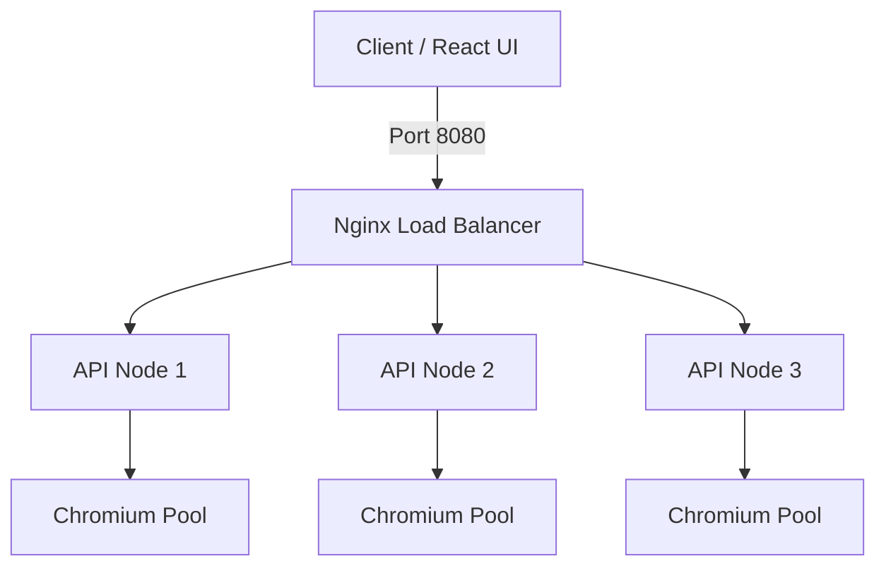

# Web Render API - Deployment Guide

This guide details how to deploy the Web Render API in a distributed, load-balanced Docker environment.

## Prerequisites

- **Docker** and **Docker Compose** installed
- **Git** installed
- Minimum System Requirements:
  - 4GB RAM (for 3 replicas)
  - 2 vCPUs

## Architecture

The deployment consists of:
1. **API Nodes**: Multiple replicas of the Web Render API (Playwright + Fastify)
2. **Load Balancer**: Nginx instance distributing traffic round-robin style
3. **Browser Pool**: Each API node manages its own pool of Chromium instances



## Quick Start

1. **Start the Cluster**
   ```bash
   docker-compose up -d --build
   ```
   *The first build may take 5-10 minutes to download browser images.*

2. **Verify Deployment**
   Check the health of the cluster:
   ```bash
   curl http://localhost:8080/health
   ```

3. **Scale Up/Down**
   To handle more traffic, increase the number of API replicas:
   ```bash
   docker-compose up -d --scale api=5
   ```

4. **Stop the Cluster**
   ```bash
   docker-compose down
   ```

## Configuration

### Environment Variables (docker-compose.yml)

| Variable | Description | Default |
|----------|-------------|---------|
| `PORT` | Internal container port | `3000` |
| `POOL_MIN_BROWSERS` | Min browsers per node | `1` |
| `POOL_MAX_BROWSERS` | Max browsers per node | `2` |
| `POOL_MAX_CONTEXTS` | Max tabs per browser | `4` |
| `LOG_LEVEL` | Logging verbosity | `info` |

### Resource Limits

Default limits per container are set in `docker-compose.yml` to prevent crashes:
- **Memory Limit**: 2GB
- **Memory Reservation**: 1GB
- **CPU**: 1.0 vCPU

Adjust these in `docker-compose.yml` based on your host machine's capacity.

## Troubleshooting

**1. "Connection Refused"**
- Ensure Docker is running.
- Check if port 8080 is available.

**2. High Memory Usage**
- Reduce the number of replicas or `POOL_MAX_BROWSERS`.
- Each browser instance takes ~200-300MB.

**3. "Browser Closed" Errors**
- This usually means a container ran out of memory. Increase Docker memory limit or reduce concurrency.

## connecting Frontend

Update your UI configuration to point to the load balancer:

**Vite (ui/vite.config.js):**
```javascript
server: {
  proxy: {
    '/v1': 'http://localhost:8080',
    '/health': 'http://localhost:8080'
  }
}
```
